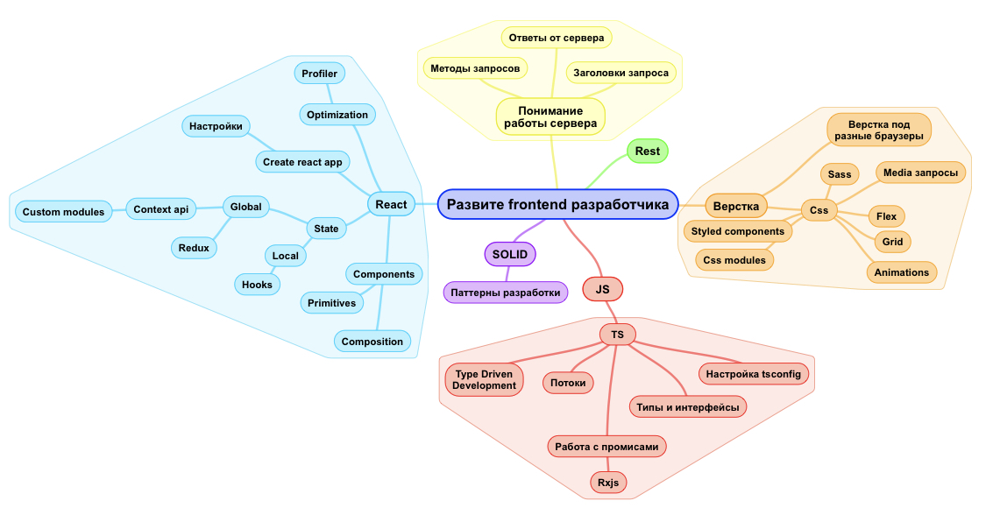
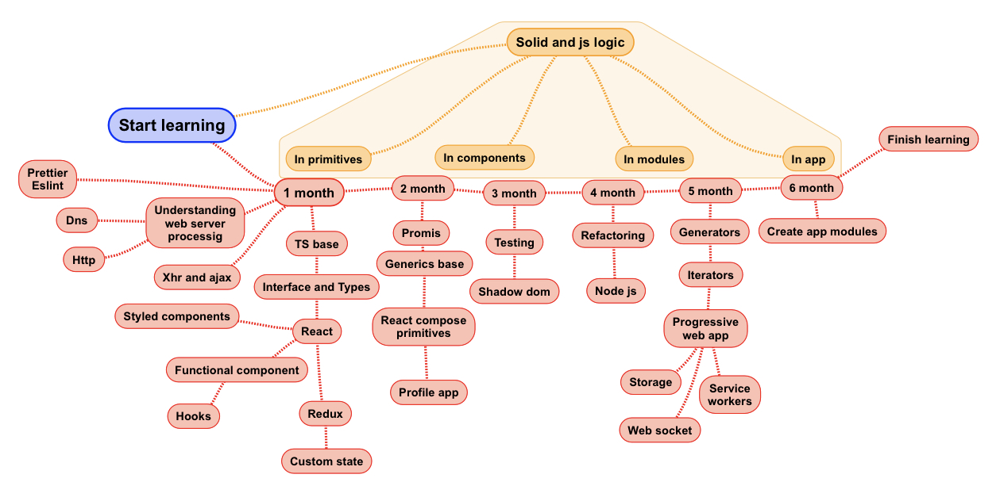

# Обучение Frontend разработке по шагам

После того, как вы завершите программу по этому учебному плану, вы получите общее представление о каждой из представленных в ней тем, и в дальнейшем сможете углубиться в любую из них при необходимости.

Любой процесс познания можно представить в виде буквы «Т», где горизонтальная линия — широкое понимание, вертикальная — глубокое. У идеального специалиста буква Т большая и красивая, равномерная. Если она вытянута в одну сторону, она некрасива, уродлива; такой специалист мало полезен в боевых делах. Он может либо глубоко разбираться в чём-то одном, но чуть шаг в сторону, и он непригоден; либо поверхностно разбираться во всём, но при этом ничего не уметь. В первую очередь необходимо максимально развить широкую составляющую, чем мы сейчас и займёмся — постараемся максимально широко охватить все аспекты фронтенда, не углубляясь. А потом вы займётесь углублением, которое останется вам на самостоятельную работу.

Для лучшего понимания объемов материала можно взглянуть на следующую диаграмму.

А в связке с процессом обучения поможет разобраться эта диаграмма:

##Полный план обучения:

- Верстка
- Базовый [JavaScript](https://learn.javascript.ru/)
- Основы работы с системой контроля версий git
- [TypeScript](http://typescript-lang.ru/docs/)
    - Экосистема TypeScript. Система типизации
    - Опредеделения типов - пишем свои, ищем и используем сторонние.
    - [Введение в дженерики в TS (En)](https://www.typescriptlang.org/docs/handbook/generics.html)
    - Дженерики в TS
    - Итераторы
    - Генераторы
- [Понимание работы web сервера](1m/web-server.md)
- Способы взаимодействия с web сервером
    - [Xml Http Request (XHR) или AJAX запросы](1m/ajax.md)
    - Сокетное соединение
    - Node js. Локальный сервер Express.js
    - [Promise](https://learn.javascript.ru/promise) и async / await
- [Что такое и зачем нужен SOLID](https://medium.com/webbdev/solid-4ffc018077da)
- React TS. Написание первого приложения
    - [Разворот тестового проекта. Использование create-react-app](1m/reactBeginner.md)
    - Что такое JSX и Virtual DOM
    - Написание первых компонентов. Использование типизации.
    - [Styled components](https://www.styled-components.com/)
    - Разбираем React Hooks, их отличия от стейта и lifecycle методов.
    - SOLID для примитивов. Введение
- Routing в React - Оптимизация приложения
- Знакомство с инструментами профилирования React приложений
- Тестирование
    - Виды тестирование. Инструменты тестирования
    - Разберем примеры тестирования компонент с помощью Jest и Enzyme.
- [Redux](https://medium.com/devschacht/redux-step-by-step-e6c42a9b00cd) и [Context Api](https://reactjs.org/docs/context.html)
    - Знакомство с менеджером контекста Redux
    - Выполнение асинхронных действий с redux-thunk
    - Введение в redux-saga и redux-observable. Введение в [Rx.js](https://habr.com/ru/post/438642/)
    - Встроенные методы работы с контекстом. Context api
    - Разбор работы с кастомным state manager'ом на основе Context api

Теперь можно описать шаги обучения подробнее в разрезе месяцов:

- Верстка
- Базовый [JavaScript](https://learn.javascript.ru/)
- Основы работы с системой контроля версий git
- [TypeScript](http://typescript-lang.ru/docs/)
    - Экосистема TypeScript. Система типизации
    - Опредеделения типов - пишем свои, ищем и используем сторонние.
    - [Введение в дженерики в TS (En)](https://www.typescriptlang.org/docs/handbook/generics.html)
    - Дженерики в TS
    - Итераторы
    - Генераторы
- [Понимание работы web сервера](1m/web-server.md)
- Способы взаимодействия с web сервером
    - [Xml Http Request (XHR) или AJAX запросы](1m/ajax.md)
    - Сокетное соединение
    - Node js. Локальный сервер Express.js
    - [Promise](https://learn.javascript.ru/promise) и async / await
- [Что такое и зачем нужен SOLID](https://medium.com/webbdev/solid-4ffc018077da)
- React TS. Написание первого приложения
    - [Разворот тестового проекта. Использование create-react-app](1m/reactBeginner.md)
    - Что такое JSX и Virtual DOM
    - Написание первых компонентов. Использование типизации.
    - [Styled components](https://www.styled-components.com/)
    - Разбираем React Hooks, их отличия от стейта и lifecycle методов.
    - SOLID для примитивов. Введение
- Routing в React - Оптимизация приложения
- Знакомство с инструментами профилирования React приложений
- Тестирование
    - Виды тестирование. Инструменты тестирования
    - Разберем примеры тестирования компонент с помощью Jest и Enzyme.
- [Redux](https://medium.com/devschacht/redux-step-by-step-e6c42a9b00cd) и [Context Api](https://reactjs.org/docs/context.html)
    - Знакомство с менеджером контекста Redux
    - Выполнение асинхронных действий с redux-thunk
    - Введение в redux-saga и redux-observable. Введение в [Rx.js](https://habr.com/ru/post/438642/)
    - Встроенные методы работы с контекстом. Context api
    - Разбор работы с кастомным state manager'ом на основе Context api
